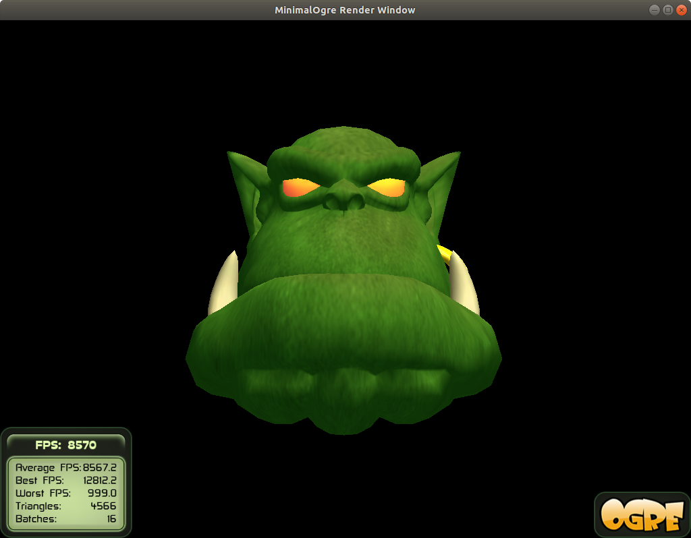

# Sample of OGRE v1.9.1
## What is this?
This is compilable [Minimal OGRE Sample for v1.9](https://wiki.ogre3d.org/tiki-index.php?page=Ogre+Wiki+Tutorial+Framework#MinimalOgre).

## Requirement
- OS: Ubuntu 18.04

## How to Build?
```bash
# Install Prerequisites
# See https://ogrecave.github.io/ogre/api/1.12/building-ogre.html
sudo apt install libzzip-dev
# Build ogre
git clone https://github.com/OGRECave/ogre.git
cd ogre
mkdir build && cd build
cmake ..
make
sudo make install
# Compile this repository
git clone https://github.com/rkoyama1623/ogre_samples.git
cd 01_minimal_ogre
mkdir build
cd build
cmake ..
make
```
## How to execute
You can show ogre head by following commands.
```bash
cd 01_minimal_ogre
./build/MinimalOgre
```


## Trouble Shooting
### mising some files
`libogre-1.9-dev` is not sufficient to compile sample program.
```bash
sudo apt install libogre-1.9-dev # Not sufficient
```
You have to build OGRE v1.9 from source.
